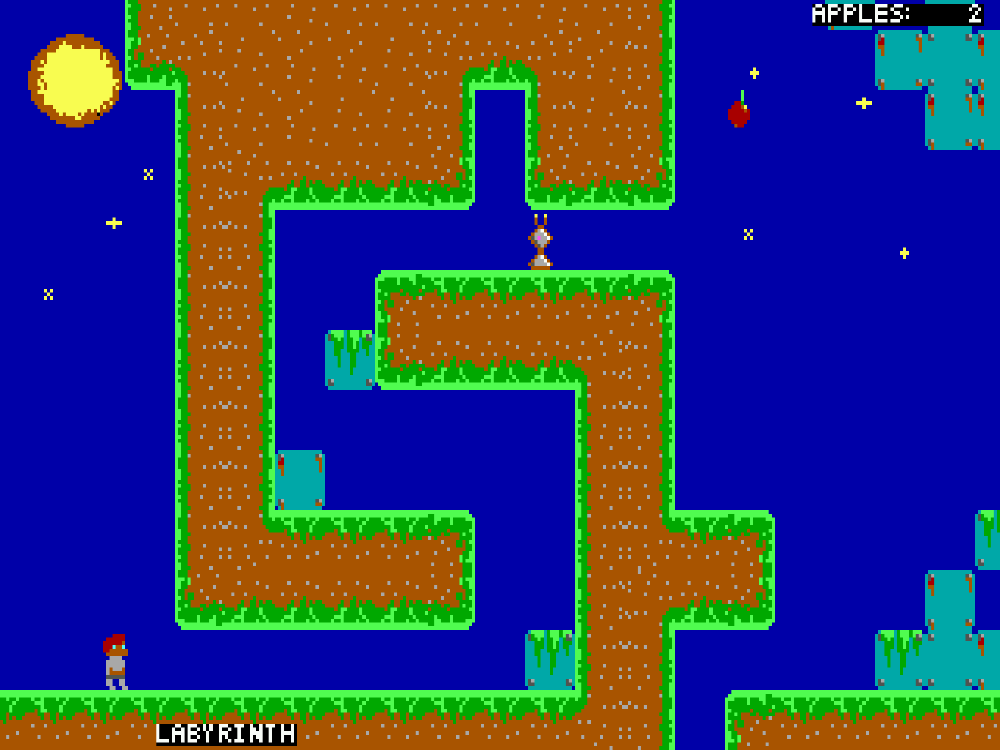
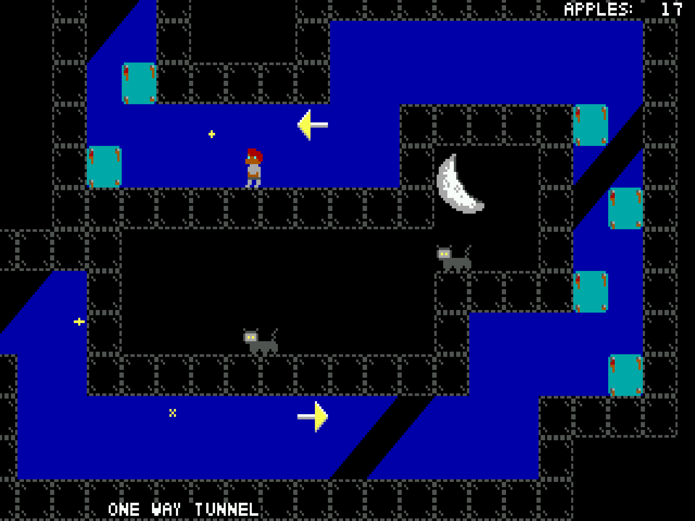

# Dos Platform Game

## Hardware Requirements

 * IBM PC or compatible
 * 8086 / 8088 or better
 * 640kb of RAM
 * VGA/MCGA compatible graphics
 * Soundblaster compatible soundcard
 * (optional) Joystick

## Floppy disk images

If you'd like the full dos game experience, ther are also floppy disk image available that include an installer:
[Floppy disk images](https://github.com/TerrySoba/DosPlatformGame/releases/download/rolling_action/images.zip)

The archive contains images for most DOS compatibe floppy formats:
 
 * 1.44MB
 * 1.2MB
 * 720KB
 * 320KB

## Screenshots

## How to run on modern systems

The game is programmed for DOS and will not run natively on recent Windows versions.
To run it on modern systems like Linux, Windows or MacOS you'll need a DOS emulator.
I recommend [Dosbox](https://www.dosbox.com/), which is available on most platforms.

## Development

If you are interessted in the development of the game hop over to the [github](https://github.com/TerrySoba/DosPlatformGame) page.
The game is licensed under the MIT license.
